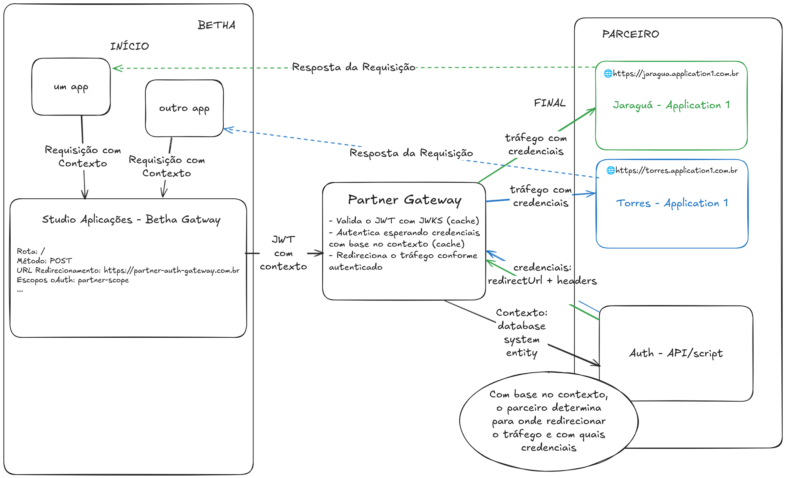

# Documentação **api-partner-gateway**

## **Índice**

- [Documentação **api-partner-gateway**](#documentação-api-partner-gateway)
    - [**Índice**](#índice)
    - [**Visão Geral**](#visão-geral)
    - [**Funcionamento Geral**](#funcionamento-geral)
        - [**Diagrama de Sequência**](#diagrama-de-sequência)
    - [**Demonstração de funcionamento**](#exemplo-de-funcionamento)
    - [**Uso pelo parceiro**](#uso-pelo-parceiro)
    - [**Execução**](#execução)
        - [**Requisitos**](#requisitos)
    - [**Testes**](#testes)

---

## **Visão Geral**

O projeto **api-partner-gateway** é uma aplicação **Node.js** que atua como um gateway/proxy entre o gateway da Betha Sistemas e aplicações de parceiros. Ele oferece um template para:

- **Validação** de credenciais fornecidas pelo gateway da Betha (via JWT).
- **Autenticação** baseada em dados de contexto da sessão no sistema betha (que deve ser customizada pelo parceiro).
- **Redirecionamento** com comportamento de gateway e proxy, incluindo as credenciais de autenticação.

---

## **Funcionamento Geral**

1. **Recebimento** de tráfego HTTP via o gateway da Betha, configurado no [Studio Aplicações](https://aplicacoes.studio.betha.cloud/).
2. **Validação** do **JWT** no [serviço de **JWKS** da Betha](https://plataforma-authentication-jwks.betha.cloud/api/v1/keys), para garantir a autenticidade do token.
3. **Autenticação** no serviço do parceiro, utilizando o contexto do JWT (entidade, sistema, e database). A classe responsável deve ser customizada conforme a necessidade do parceiro.
4. **Redirecionamento** do tráfego para o sistema do parceiro, anexando as credenciais obtidas.
5. **Cache** das requisições (tanto de autenticação quanto de validação do JWT) para garantir performance.

### **Diagrama de Sequência**



---

## **Demonstraçao de funcionamento**

Neste projeto, outra aplicação está configurada como mock para demonstrar a utilização do serviço de gateway. A sua definição se encontra em `./partner-mock-application`. Ela disponibiliza um endpoint para autenticação e para simular uma aplicação genérica do parceiro.

Ao executar ambas aplicações (gateway e mock), é possível realizar uma requisição para o gateway (localhost:3000) em qualquer path e ele irá redirecionar a requisição para a aplicação mock (localhost:3001) no mesmo path, anexando as credenciais de autenticação obtidas no processo de autenticação.

---

## **Uso pelo parceiro**

1. **Fazer um fork** do repositório.
2. **Configurar** as variáveis de ambiente necessárias (ver `.env.example`).
3. **Customizar a classe de autenticação**:

    - A classe `AuthImpl` (em `/src/gateway/auth/auth.impl.ts`) é fornecida como exemplo de configuração.
        - Ela está sendo instanciada em `/src/gateway/gateway.routes.ts` como dependência da classe de cache `CachingAuthProvider`.
    - Para customizar a autenticação, recomendamos:
        1. Criar uma nova classe que **implemente** a interface `AuthProvider` (disponível em `/src/gateway/auth/auth.provider.ts`) e configurar a autenticação conforme necessário.
        2. Configurar a instância da classe criada no `/src/gateway/gateway.routes.ts`.

4. **Escolher o tipo de cache**:
    - **In-memory cache** (via [node-cache](https://www.npmjs.com/package/node-cache)) ou **Redis**.
    - Para Redis, defina `USE_REDIS=true` e configure `REDIS_URL`.
    - Para in-memory cache, defina `USE_REDIS=false`.
    - O cache para validação de JWT no JWKS da Betha é sempre realizado em memória. Para configurá-lo, defina `JWKS_CACHE_MAX_ENTRIES` e `JWKS_CACHE_AGE`.

---

## **Execução**

### **Requisitos**

- **Node.js** versão **22**
- **npm** versão **10**

1. **Instale as dependências**:
    ```bash
    npm install
    ```
2. **Build e execução** em produção:
    ```bash
    npm run build
    npm start
    ```

---

## **Testes**

Este projeto utiliza **Jest** e **Supertest** para testes unitários e de integração.  
Para executa-los, utilize:

```bash
npm run test
```

---

Para mais detalhes ou suporte, entre em contato com a equipe responsável.
